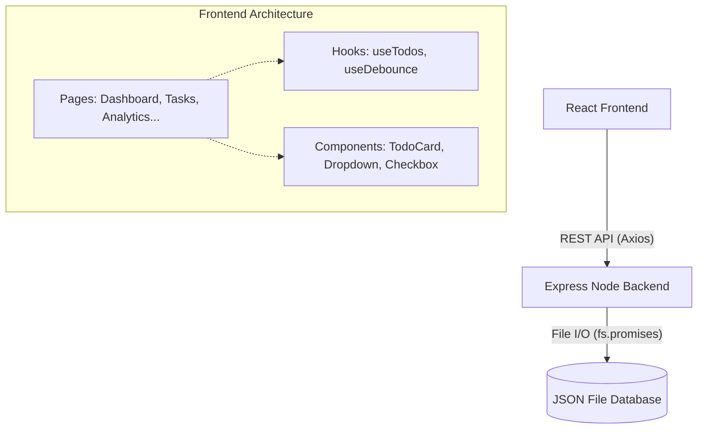

# 🏗️ Architecture Overview

The application utilizes a classic decoupled Client-Server architecture.

## Frontend (React)
- **Routing**: `react-router-dom` handles navigation. Pages are lazy-loaded via `React.lazy()` to dramatically reduce the initial JavaScript bundle size.
- **State Management**: Instead of over-engineering with Redux (which violates assignment constraints of keeping it simple), complex state is abstracted into custom hooks (`useTodos`).
- **Styling**: Tailwind CSS is used extensively for utility-first styling, ensuring zero CSS file bloat and consistent design tokens (colors, spacing).
- **Component Design**: 
  - Components are heavily modularized. 
  - `TodoForm` acts as a highly reusable "dumb" component that is fed data by smart page wrappers (`AddTodo` and `EditTodo`).
  - Headless UI concepts are used for `Dropdown` and `Checkbox` to ensure they remain perfectly accessible.

## Backend (Node/Express)
- **Database**: To strictly adhere to assignment constraints (avoiding heavy databases like MongoDB/Postgres), the backend utilizes a flat JSON file (`data/todos.json`).
- **Concurrency & Safety**: File operations are wrapped in `fs.promises` inside `utils/fileHandler.js`.
- **Structure**: 
  - `server.js`: Entry point.
  - `routes/todoRoutes.js`: Maps HTTP methods to specific controller functions.
  - `controllers/todoController.js`: Houses business logic.
  - `middleware/errorHandler.js`: Catches exceptions and returns standardized JSON errors.
