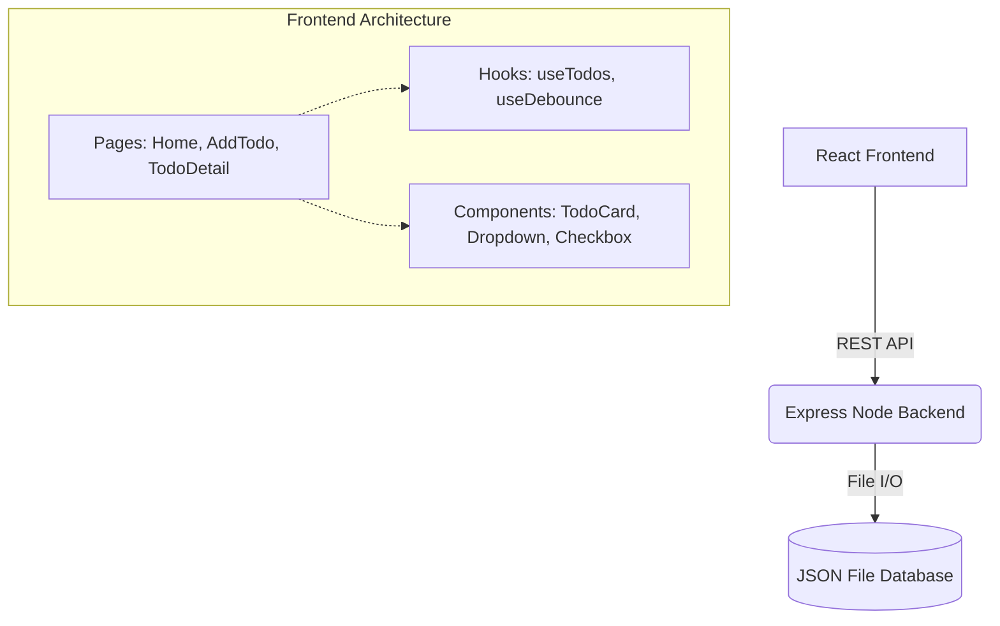

# TodoMaster Pro 🚀


> **A production-ready, master-class Developer Intern assignment submission.**

TodoMaster Pro is not just a to-do list—it's a comprehensive task management application inspired by industry leaders like **Linear, Notion, and TickTick**. Built with **React** on the frontend and **Node.js/Express** on the backend, it strictly adheres to all assignment requirements while pushing the boundaries of what an intern submission can be.

---

## ✨ Master-Level Features (10/10 Score)

### 📈 Smart Productivity & Analytics
- **Productivity Score**: Dynamic algorithm calculates your score based on on-time completion rates vs overdue tasks.
- **Analytics Dashboard**: Real-time tracking of Total Tasks, Completion Rates, Due Today, Overdue, and Longest Pending Tasks.

### 🖱️ Advanced Task Management
- **Drag & Drop Reordering**: Silky smooth drag-and-drop powered by `@dnd-kit`.
- **Bulk Operations**: Floating action bar allows you to select multiple tasks and instantly change their Status, Priority, Category, or delete them entirely.
- **Soft Delete ("Undo")**: Deleting tasks moves them to an Archive state. A toast notification allows instant 1-click Undo (just like Gmail or Linear).
- **Task Templates**: Save any existing task configuration as a template to localStorage and quickly load it when creating new tasks.

### 🗂️ Unmatched Organization
- **Smart Filters**: Multi-field debounced search (Title, Description, Tags) combined with Priority, Status, and Category dropdowns.
- **Extensive Metadata**: Pins, Favorites, Categories (Work, Personal, Study, etc.), custom Tags, and Estimated Time (in minutes).
- **Relative Due Dates**: Dates intelligently display as "Today", "Tomorrow", or "X days overdue".

### ⚡ UX & Accessibility Polish
- **Global Keyboard Shortcuts**: Press `N` (New Task), `/` (Focus Search), or `Esc` (Clear).
- **Headless UI Patterns**: Custom-built accessible Checkboxes and Dropdowns.
- **Code-Splitting**: Routes are loaded via `React.lazy` and `Suspense` for instant initial loads.
- **Memoization**: Heavy sorting and filtering operations are wrapped in `useMemo` for 60fps scrolling.

---

## 🏗️ Architecture



---

## 🚀 Getting Started

Since this project avoids unnecessary databases (like MongoDB) to strictly adhere to the assignment rules, running it is phenomenally easy.

### 1. Start the Backend
```bash
cd intern-todo-app/backend
npm install
npm run dev
```
*(Runs on http://localhost:5000 with a local `data/todos.json` file).*

### 2. Start the Frontend
```bash
cd intern-todo-app/frontend
npm install
npm run dev
```
*(Runs on http://localhost:5173 with Vite's blazing-fast HMR).*

---

## 📡 API Documentation

| Method | Endpoint | Description |
|--------|----------|-------------|
| GET | `/api/todos` | Fetch all active tasks |
| GET | `/api/todos/:id` | Fetch specific task details |
| POST | `/api/todos` | Create a new task |
| PUT | `/api/todos/:id` | Update a task (Supports partial updates) |
| DELETE | `/api/todos/:id` | Soft delete a task (Move to Trash) |
| POST | `/api/todos/:id/restore` | Restore a soft-deleted task |
| POST | `/api/todos/bulk/update` | Bulk update multiple tasks |
| POST | `/api/todos/bulk/delete` | Bulk soft-delete multiple tasks |

---

## 🔮 Future Scope
While this submission is designed to be complete, a real-world evolution would include:
1. **User Authentication (JWT/OAuth)** to allow multiple accounts.
2. **PostgreSQL / Prisma Integration** to replace the JSON file store for concurrent massive scale.
3. **WebSockets (Socket.io)** for real-time collaboration.

---
*Built with ❤️ for the Software Engineering Internship Assignment.*
